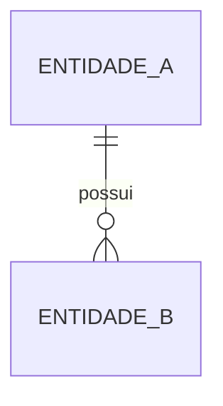

# Modelo de Dados

## Entidades principais
(tabela: entidade | descrição | atributos-chave)

## Relacionamentos
(descrição ou diagrama — pode usar mermaid)

```mermaid
erDiagram
    ENTIDADE_A ||--o{ ENTIDADE_B : possui
```
