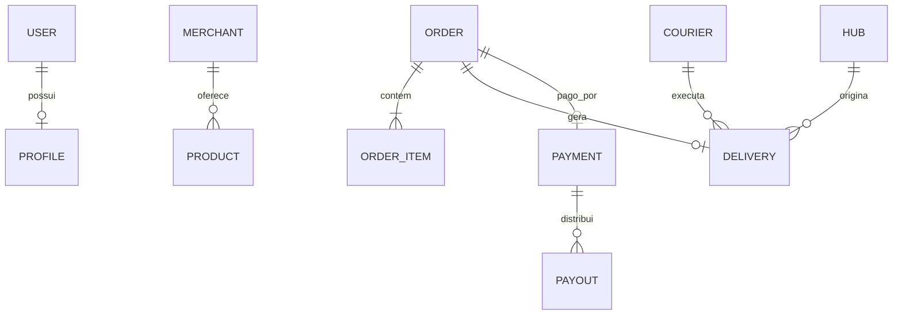

# Modelo de Dados

Cada microserviço possui schema Postgres próprio. Entidades compartilhadas referenciam IDs externos (ex.: `user_id` do identity-service).

## Entidades por serviço
| Serviço | Entidade | Descrição | Atributos-chave |
|---|---|---|---|
| identity-service | User | Usuário da plataforma | id, email, password_hash, role |
| identity-service | Profile | Dados de perfil | user_id, name, phone, document |
| merchant-service | Merchant | Estabelecimento | id, name, cnpj, address, owner_user_id |
| merchant-service | Product | Item do catálogo | id, merchant_id, name, price, stock |
| order-service | Order | Pedido | id, customer_id, merchant_id, status, total |
| order-service | OrderItem | Linha do pedido | order_id, product_id, qty, unit_price |
| logistics-service | Courier | Entregador | id, user_id, vehicle_type, status |
| logistics-service | Delivery | Corrida/entrega | id, order_id, courier_id, hub_id, status |
| logistics-service | Hub | Posto/coleta | id, name, geo, capacity |
| payment-service | Payment | Transação | id, order_id, amount, status, method |
| payment-service | Payout | Repasse | id, payment_id, recipient_type, amount |

## Relacionamentos (lógicos — entre serviços)

