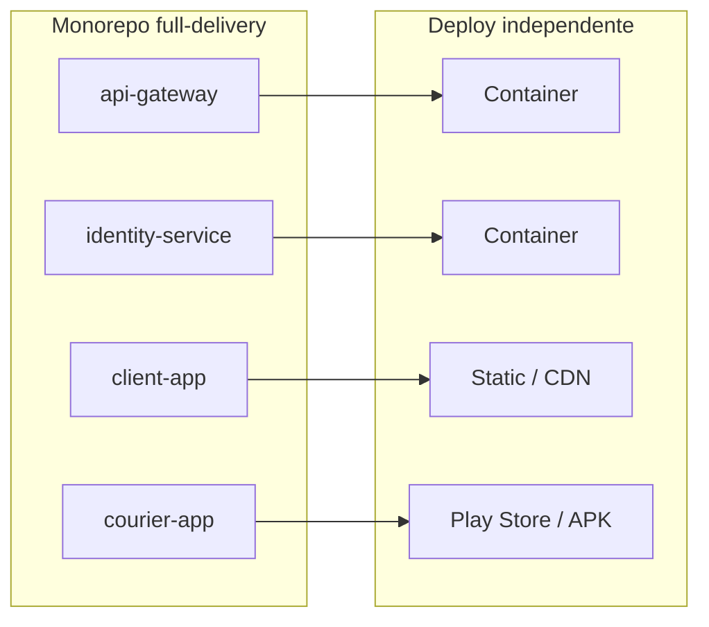

# Organização do Monorepo

Este documento explica **onde fica cada coisa** no repositório `full-delivery` e como isso se relaciona com microserviços, squads, front e mobile.

> Decisão formal: [ADR-003](decisions/ADR-003-monorepo.md)

## Conceitos rápidos

| Termo | Significado |
|---|---|
| **Microserviço** | Serviço que **roda e faz deploy separado** (container, static hosting, app store). |
| **Monorepo** | **Um repositório Git** com vários projetos dentro. |
| **Squad** | Time dono de **um** serviço (ver `docs/04-time/squads.json`). |

Microserviço ≠ repositório separado. Vocês têm **vários microserviços dentro de um monorepo**.

## Árvore do repositório

```
full-delivery/                 ← único repositório Git
├── config/                    ← metadados do projeto
├── docs/                      ← planejamento (negócio, técnico, entrega, time, ops)
├── gerenciador-projetos/      ← app local de gestão do backlog
├── packages/                  ← bibliotecas compartilhadas (ex.: eventos, tipos)
│   └── shared-events/         ← (futuro)
└── services/                  ← todo código de produção
    ├── api-gateway/           ← NestJS — squad plataforma
    ├── identity-service/      ← NestJS — squad identidade
    ├── merchant-service/      ← NestJS — squad estabelecimentos
    ├── order-service/         ← NestJS — squad pedidos
    ├── logistics-service/     ← NestJS — squad logística
    ├── payment-service/       ← NestJS — squad pagamentos
    ├── client-app/            ← React (web cliente) — squad app-cliente
    └── courier-app/           ← Flutter (app entregador) — squad app-entregador
```

Cada pasta em `services/` tem um `README.md` com o squad dono.

## Onde ficam front e mobile?

| Produto | Pasta | Stack | Acesso |
|---|---|---|---|
| App web do **cliente** | `services/client-app/` | React | Browser → api-gateway |
| App **entregador** | `services/courier-app/` | Flutter | Mobile → api-gateway |
| Portal do **lojista** (planejado) | `services/merchant-portal/` ou módulo em merchant | React | Browser → api-gateway |

**Não** criamos repositórios separados para front/mobile no MVP. Eles são **apps deployáveis** com pasta própria, assim como os backends.

## Mapa squad → pasta → pessoa

Fonte de verdade: `docs/04-time/squads.json` + `team.json`.

| Squad | Serviço / app | Pasta | Dono principal |
|---|---|---|---|
| plataforma | api-gateway | `services/api-gateway/` | Gabriel |
| identidade | identity-service | `services/identity-service/` | Ana |
| estabelecimentos | merchant-service | `services/merchant-service/` | Gerson |
| pedidos | order-service | `services/order-service/` | Elton |
| logistica | logistics-service | `services/logistics-service/` | Mark |
| pagamentos | payment-service | `services/payment-service/` | (a definir) |
| app-cliente | client-app | `services/client-app/` | Beatriz (+ dev) |
| app-entregador | courier-app | `services/courier-app/` | John (+ dev) |

## Workspaces e ferramentas

### Backends + React (npm)
Na raiz, `package.json` com **npm workspaces**:

```json
{
  "workspaces": ["services/*", "packages/*"]
}
```

Serviços NestJS e `client-app` (React) participam do workspace. Scripts na raiz orquestram dev/build/test (ver STORY-060).

### Flutter (pub)
`courier-app` usa **pub** (`pubspec.yaml`), não npm. Permanece em `services/courier-app/` no mesmo repo — monorepo **misto**, padrão comum em times pequenos.

## Deploy vs código



- Alterou só `services/order-service/` → CI publica só o order-service.
- Alterou `packages/shared-events/` → CI pode rebuildar serviços dependentes.

## Fluxo de trabalho Git

1. Pegar card: `STORY-XXX` no gerenciador.
2. Branch: `feature/STORY-XXX-slug` (ver `docs/05-ops/vinculo-git-tasks.md`).
3. Trabalhar **na pasta do seu squad** em `services/`.
4. PR com título `STORY-XXX — …`; review pelo dono do serviço ou tech lead.
5. Merge → deploy daquele serviço (quando CI estiver ativo).

## O que **não** vai no monorepo de produção

| Conteúdo | Onde fica |
|---|---|
| Documentação de produto | `docs/` |
| Gerenciador de projetos | `gerenciador-projetos/` |
| Exemplos de estudo | `examples/` |

## Quando reavaliar multi-repo?

Considerar repos separados apenas se:
- time grande com conflitos frequentes de merge;
- ciclos de release muito diferentes (ex.: app mobile mensal vs API diária);
- requisitos de compliance exigirem isolamento por serviço.

Até lá, **permanece monorepo**.

## Links relacionados
- [Arquitetura do sistema](system-architecture.md)
- [Tech stack](tech-stack.md)
- [ADR-002 — Microserviços](decisions/ADR-002-arquitetura-microservicos.md)
- [ADR-003 — Monorepo](decisions/ADR-003-monorepo.md)
