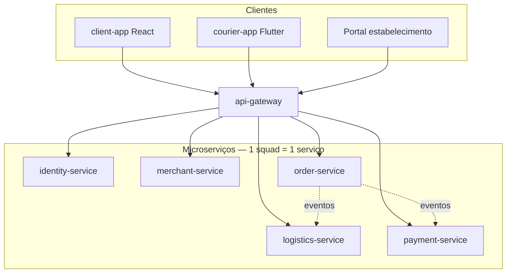

# Arquitetura do Sistema

## Visão geral
Arquitetura de **microserviços**: cada squad é dono de um serviço deployável. O **api-gateway** centraliza autenticação, roteamento e rate limit.

## Componentes
| Serviço | Squad | Responsabilidade | Stack |
|---|---|---|---|
| api-gateway | plataforma | Roteamento, auth middleware, contratos OpenAPI | NestJS |
| identity-service | identidade | Login, JWT, perfis, papéis (cliente/entregador/lojista) | NestJS + Postgres |
| merchant-service | estabelecimentos | Lojas, catálogo, horários | NestJS + Postgres |
| order-service | pedidos | Pedidos, status, histórico | NestJS + Postgres |
| logistics-service | logistica | Entregadores, corridas, hubs, rotas | NestJS + Postgres |
| payment-service | pagamentos | Cobrança, split, repasse | NestJS + Postgres |
| client-app | app-cliente | UI comprador | React |
| courier-app | app-entregador | UI entregador | Flutter |

## Fluxo de dados — pedido ponta a ponta
1. Cliente autentica via **identity-service** (token JWT no gateway).
2. Cliente monta carrinho consultando **merchant-service**.
3. **order-service** cria pedido e emite evento `order.created`.
4. **payment-service** processa pagamento e confirma `payment.approved`.
5. **logistics-service** aloca entregador/coleta e atualiza rastreio.
6. Apps consultam status via gateway; eventos mantêm serviços desacoplados.

## Princípios
- Banco por serviço — sem join cross-service no DB.
- Contratos versionados no gateway (plataforma).
- Deploy independente por squad.

## Organização do código
Todo o código de produção vive em um **monorepo** — ver [monorepo.md](monorepo.md) e [ADR-003](decisions/ADR-003-monorepo.md).
